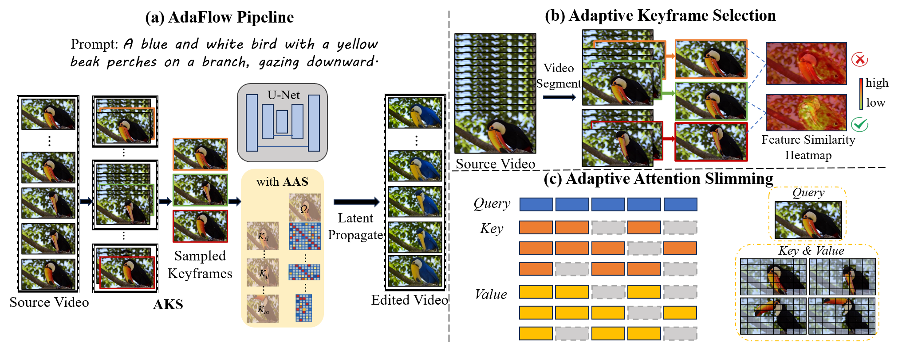

# AdaFlow: Efficient Long Video Editing via Adaptive Attention Slimming And Keyframe Selection

**AdaFlow** is a training-free method for efficient long video editing, leveraging adaptive attention slimming and keyframe selection to handle over 1k frames in a single GPU inference while maintaining high quality and temporal consistency, validated on the novel LongV-EVAL benchmark.

## Overview



## Sample Results


## Environment

```text
conda env create -f environment.yml
```

## Preprocess

Preprocess you video by running using the following command:

```
python preprocess.py --data_path <data/myvideo.mp4>
```

Additional arguments:

```
                     --save_dir <latents>
                     --H <video height>
                     --W <video width>
                     --sd_version <Stable-Diffusion version>
                     --steps <number of inversion steps>
                     --save_steps <number of sampling steps that will be used later for editing>
                     --n_frames <number of frames>
```

## Editing

To edit your video, first create a yaml config as yaml files in `configs`. Then run

```
python run.py --config_path <yaml config file path>
```

## LongV-EVAL

**LongV-EVAL** is a benchmark designed for evaluating text-driven long video editing methods, featuring 75 high-quality videos (~1 minute each) spanning diverse scenes (humans, landscapes, animals, etc.) with three annotated editing prompts per video (foreground, background, style). It includes metrics for frame quality, video quality, object consistency, and semantic consistency to comprehensively assess editing performance.

Coming Soon!

## Citation

## Acknowledgment

We would like to acknowledge that part of our code is derived from the open-source project [TokenFlow](https://github.com/omerbt/TokenFlow). Thanks for their amazing work!